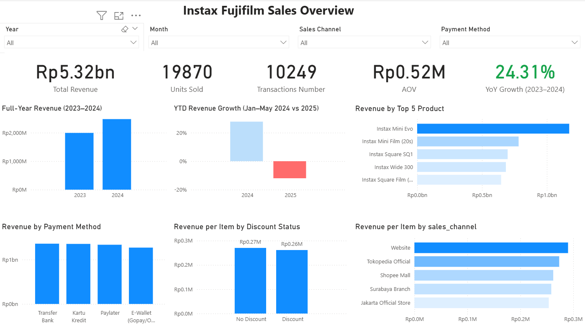

# 📸 Instax Fujifilm Sales Overview

---

## 📌 Overview

This project presents a sales analysis dashboard for Instax Fujifilm products, covering the period from January 2023 to May 2025 using SQL, MS Excel, Python, and Power BI.

The goal of this project is to understand sales performance, customer behavior, and business trends.

## 📈 Dashboard Preview

The dashboard provides a comprehensive view of key business metrics, including:
- Total Revenue  
- Units Sold  
- Transactions Number 
- Average Order Value (AOV)
- Year-over-Year (YoY) Growth (2023-2024)

## ✏️ Business Problems

The company has shown strong growth in previous years, but recent data indicate a possible slowdown. However, the reasons for this change remain unclear.

To better understand the situation, several key questions need to be explored:

- Is the recent decline part of a long-term trend or just a temporary change?
- Which products are driving revenue, and are there any shifts in performance?
- Do discounts meaningfully impact customer purchasing behavior?
- How do customer preferences differ across payment methods and sales channels?

Understanding these areas is essential to support better business decisions and sustain growth. 

---
## 🎯 Objective

This project aims to:

- Evaluate sales performance
- Identify key factors influencing revenue trends, including products, discounts, and customer payment behavior

---
## 📂 Data Overview

- **Source**: Fujifilm Instax Sales Transaction Data (Synthetic) (Kaggle)  
- **Period**: January 2023 – May 2025  
- **Scope**:
  - 10249 transactions
  - 10 product names
  - 3 product categories

### Key Columns
- `date`  
- `category`
- `product_name`  
- `sales_channel`  
- `payment_method`  
- `base_price`  
- `quantity`  
- `discount`
- `revenue` 

---

## 🛠 Tools & Technologies

* SQL – Data cleaning and preparation
* Python (Pandas) – Exploratory data analysis (EDA)
* MS Excel - Quick validating EDA result
* Power BI – Data visualization and dashboard creation

---

## 🔄 Project Workflow

Raw Data → SQL → Python (EDA) → Excel (Validation) → Power BI (Dashboard)

